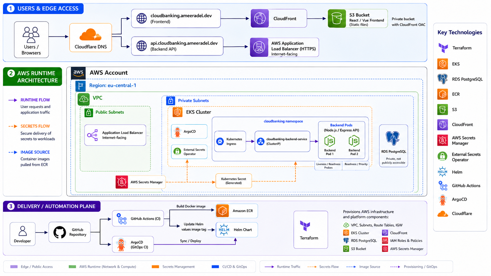

# CloudBanking — Cloud-Native Digital Banking Platform on AWS

CloudBanking is a cloud-native digital banking platform deployed on AWS using Terraform, EKS, RDS PostgreSQL, ECR, S3, CloudFront, AWS Secrets Manager, Helm, GitHub Actions, and ArgoCD.

The goal of this project is to demonstrate a production-style DevOps architecture, not just to run an application. It covers infrastructure provisioning, containerized backend deployment, managed database integration, secure secrets management, frontend static hosting, HTTPS routing, CI pipelines, and GitOps-based continuous delivery.

---

## Live URLs

| Component | URL |
|---|---|
| Frontend | `https://cloudbanking.ameeradel.dev` |
| Backend API | `https://api.cloudbanking.ameeradel.dev` |

---

## Project Overview

CloudBanking is a digital banking demo platform with:

- React/Vite frontend hosted as static files on private S3 through CloudFront.
- Node.js/Express backend running on Amazon EKS.
- PostgreSQL database hosted on private Amazon RDS.
- Backend Docker images stored in Amazon ECR.
- Infrastructure managed with Terraform.
- Secrets stored in AWS Secrets Manager and synced to Kubernetes using External Secrets Operator.
- Backend Kubernetes resources packaged with Helm.
- GitHub Actions used to build and push backend images.
- ArgoCD used for GitOps deployment to EKS.

---

## Architecture



---

## Tech Stack

| Area | Technology |
|---|---|
| Infrastructure as Code | Terraform |
| Cloud Provider | AWS |
| Kubernetes | Amazon EKS |
| Container Registry | Amazon ECR |
| Database | Amazon RDS PostgreSQL |
| Backend | Node.js, Express |
| Frontend | React, Vite |
| Static Hosting | S3 + CloudFront |
| DNS | Cloudflare |
| HTTPS Certificates | AWS ACM |
| Secrets Management | AWS Secrets Manager |
| Kubernetes Secrets Sync | External Secrets Operator |
| Load Balancing | AWS Application Load Balancer |
| Ingress | Kubernetes Ingress + AWS Load Balancer Controller |
| Application Packaging | Helm |
| CI | GitHub Actions |
| CD / GitOps | ArgoCD |

---

## Infrastructure Overview

Terraform is used as the main source of truth for infrastructure and platform-level components.

Terraform manages:

- VPC
- Public and private subnets
- Internet Gateway
- NAT Gateway
- Route tables
- EKS cluster
- EKS node group
- ECR repository
- RDS PostgreSQL
- AWS Secrets Manager secret
- External Secrets Operator
- AWS Load Balancer Controller
- S3 bucket
- CloudFront distribution
- IAM roles and policies
- GitHub Actions OIDC role
- ArgoCD installation

---

## Network Design

The AWS network is designed with public and private subnets.

```text
VPC
├── Public Subnets
│   ├── NAT Gateway
│   └── Public ALB
│
└── Private Subnets
    ├── EKS Worker Nodes
    └── RDS PostgreSQL
```

The backend pods run on EKS worker nodes inside private subnets.

The RDS database is also private and is not exposed directly to the internet.

The public entry point for backend traffic is the AWS Application Load Balancer created by the AWS Load Balancer Controller.

---

## Backend Runtime Flow

```text
Client / Frontend
↓
api.cloudbanking.ameeradel.dev
↓
AWS ALB
↓
Kubernetes Ingress
↓
cloudbanking-backend-service
↓
Backend Pods
↓
RDS PostgreSQL
```

The backend exposes APIs for:

```text
GET  /health
GET  /ready
GET  /metrics

GET  /api/accounts
POST /api/accounts

POST /api/transfers

GET  /api/transactions
GET  /api/accounts/:id/transactions
```

---

## Backend Health and Readiness

The backend includes production-style health endpoints.

### `/health`

Checks if the application process is alive.

This endpoint is used by Kubernetes liveness probes.

### `/ready`

Checks if the backend can connect to PostgreSQL.

This endpoint is used by Kubernetes readiness probes.

If the database connection fails, the pod is not considered ready to receive traffic.

---

## Database

The database is hosted on Amazon RDS PostgreSQL.

RDS is placed in private subnets and is not publicly accessible.

Only the EKS backend workload can connect to RDS through controlled security group rules.

The backend initializes tables for:

- Accounts
- Transactions

Transfers are handled using database transactions to keep balance updates atomic.

```text
BEGIN
↓
Lock accounts with FOR UPDATE
↓
Deduct balance from source account
↓
Add balance to destination account
↓
Insert transaction record
↓
COMMIT
```

If any step fails, the transaction is rolled back.

---

## Secrets Management

Secrets are stored in AWS Secrets Manager.

The backend database credentials are stored as a JSON secret:

```json
{
  "DB_HOST": "rds-endpoint",
  "DB_PORT": "5432",
  "DB_NAME": "cloudbanking",
  "DB_USER": "cloudbanking_user",
  "DB_PASSWORD": "generated-password",
  "DB_SSL": "true"
}
```

External Secrets Operator runs inside EKS and syncs this AWS secret into a Kubernetes Secret.

```text
AWS Secrets Manager
↓
External Secrets Operator
↓
Kubernetes Secret
↓
Backend Pod environment variables
```

The backend deployment reads database credentials from the Kubernetes Secret.

This avoids storing secrets in:

- GitHub
- Kubernetes manifests
- Terraform variable files
- Docker images

---

## Frontend Hosting

The frontend is built with React/Vite and hosted as static files.

```text
React/Vite build
↓
dist/
↓
S3 private bucket
↓
CloudFront
↓
cloudbanking.ameeradel.dev
```

The S3 bucket is private.

CloudFront accesses the bucket using Origin Access Control.

Users do not access S3 directly.

CloudFront also handles HTTPS and SPA routing behavior.

---

## DNS and HTTPS

DNS is managed in Cloudflare.

The domain was purchased from Namecheap, but the nameservers were changed to Cloudflare.

Frontend:

```text
cloudbanking.ameeradel.dev
↓
Cloudflare DNS
↓
CloudFront
↓
S3
```

Backend:

```text
api.cloudbanking.ameeradel.dev
↓
Cloudflare DNS
↓
AWS ALB
↓
EKS Backend Service
```

ACM certificates are used for HTTPS.

Important certificate regions:

| Component | Domain | ACM Region |
|---|---|---|
| CloudFront frontend | `cloudbanking.ameeradel.dev` | `us-east-1` |
| ALB backend API | `api.cloudbanking.ameeradel.dev` | `eu-central-1` |

---

## Kubernetes Resources

The backend application uses:

- Deployment
- Service
- Ingress
- SecretStore
- ExternalSecret

The backend deployment runs two replicas.

The service is internal:

```text
ClusterIP
```

Public traffic enters through ALB and Kubernetes Ingress.

---

## Helm

The backend Kubernetes resources are packaged as a Helm chart.

```text
helm/
└── cloudbanking-backend/
    ├── Chart.yaml
    ├── values.yaml
    └── templates/
        ├── deployment.yaml
        ├── service.yaml
        ├── ingress.yaml
        └── external-secret.yaml
```

Helm values control:

- Image repository
- Image tag
- Replica count
- Resource requests and limits
- Probe paths
- Service configuration
- Ingress host and ALB annotations
- External Secrets configuration

Example image section:

```yaml
image:
  repository: 777208093235.dkr.ecr.eu-central-1.amazonaws.com/cloudbanking-backend
  tag: 4ec6555
  pullPolicy: Always
```

---

## CI/CD and GitOps

The project uses GitHub Actions for CI and ArgoCD for CD.

### CI Flow

```text
Developer pushes backend code
↓
GitHub Actions starts
↓
Docker image is built
↓
Image is tagged with Git commit SHA
↓
Image is pushed to ECR
↓
Helm values image tag is updated
↓
Change is committed back to Git
```

### GitOps CD Flow

```text
Git commit updates Helm values
↓
ArgoCD detects Git change
↓
ArgoCD syncs Helm chart
↓
EKS deployment rolls out new image
↓
Backend pods run new version
```

This makes Git the source of truth for application deployment.

---

## GitHub Actions

The backend CI workflow:

- Uses GitHub OIDC to authenticate with AWS.
- Does not use static AWS access keys.
- Builds the backend Docker image.
- Pushes image tags to ECR.
- Updates Helm image tag with the short commit SHA.
- Pushes the updated Helm values file back to Git.

Example image tag:

```text
777208093235.dkr.ecr.eu-central-1.amazonaws.com/cloudbanking-backend:4ec6555
```

---

## ArgoCD

ArgoCD is installed in the EKS cluster and manages the backend deployment using the Helm chart.

ArgoCD watches:

```text
repo: https://github.com/ameeradel/cloudbanking.git
branch: main
path: helm/cloudbanking-backend
```

Application status:

```text
Synced
Healthy
```

ArgoCD self-heals the cluster if the live state drifts from Git.

---

## Repository Structure

```text
cloudbanking/
├── backend/
│   ├── Dockerfile
│   ├── package.json
│   └── src/
│       └── app.js
│
├── frontend/
│   ├── src/
│   ├── package.json
│   └── vite.config.ts
│
├── terraform/
│   ├── providers.tf
│   ├── main.tf
│   ├── eks.tf
│   ├── rds.tf
│   ├── secrets-manager.tf
│   ├── external-secrets.tf
│   ├── aws-load-balancer-controller.tf
│   ├── frontend-hosting.tf
│   ├── github-actions-oidc.tf
│   ├── argocd.tf
│   ├── variables.tf
│   └── outputs.tf
│
├── helm/
│   └── cloudbanking-backend/
│       ├── Chart.yaml
│       ├── values.yaml
│       └── templates/
│
├── argocd/
│   └── cloudbanking-backend-app.yaml
│
├── k8s/
│   ├── backend/
│   ├── ingress/
│   └── secrets/
│
└── .github/
    └── workflows/
        └── backend-ci.yml
```

---

## Deployment Flow

### Infrastructure

```bash
cd terraform
terraform init
terraform plan
terraform apply
```

### Backend Image Build and Push

Handled by GitHub Actions.

Manual build example:

```bash
docker build -t cloudbanking-backend ./backend
```

### Helm Deployment

Handled by ArgoCD.

Manual Helm command used during migration:

```bash
helm upgrade --install cloudbanking-backend ./helm/cloudbanking-backend -n cloudbanking
```

### Frontend Build and Upload

```bash
cd frontend
npm run build

aws s3 sync dist/ s3://cloudbanking-dev-frontend-777208093235 --delete --profile cloudbanking

aws cloudfront create-invalidation \
  --distribution-id E2VPXJ8QYX5AUB \
  --paths "/*" \
  --profile cloudbanking
```

---

## Useful Commands

Check EKS nodes:

```bash
kubectl get nodes
```

Check backend pods:

```bash
kubectl get pods -n cloudbanking
```

Check backend deployment image:

```bash
kubectl describe deployment cloudbanking-backend -n cloudbanking | grep Image
```

Check ArgoCD application:

```bash
kubectl get applications -n argocd
```

Check ECR images:

```bash
aws ecr describe-images \
  --repository-name cloudbanking-backend \
  --region eu-central-1 \
  --profile cloudbanking \
  --query 'imageDetails[?imageTags!=null].imageTags[]' \
  --output table
```

Check backend health:

```bash
curl https://api.cloudbanking.ameeradel.dev/health
```

Check backend readiness:

```bash
curl https://api.cloudbanking.ameeradel.dev/ready
```

Check accounts API:

```bash
curl https://api.cloudbanking.ameeradel.dev/api/accounts
```

---

## Key Production Concepts Demonstrated

This project demonstrates:

- Infrastructure as Code with Terraform
- Private networking on AWS
- EKS managed Kubernetes
- Private RDS PostgreSQL
- ECR-based image storage
- S3 + CloudFront static frontend hosting
- HTTPS with ACM
- Cloudflare DNS integration
- Kubernetes health and readiness probes
- Externalized secrets with AWS Secrets Manager
- External Secrets Operator with IRSA
- ALB-based ingress using AWS Load Balancer Controller
- Helm-based application packaging
- GitHub Actions CI with AWS OIDC
- ArgoCD GitOps deployment
- Commit-SHA based image versioning
- Kubernetes rollout automation

---

## Troubleshooting Notes

### RDS connection failed with `no pg_hba.conf entry ... no encryption`

Cause:

The backend attempted to connect to RDS without SSL.

Fix:

Set:

```env
DB_SSL=true
```

and pass it through:

```text
AWS Secrets Manager
↓
ExternalSecret
↓
Kubernetes Secret
↓
Backend Deployment env
```

---

### ECR image name became `cloudbanking-backendatest`

Cause:

Shell variable parsing issue.

Wrong:

```bash
$ECR_REPO_NAME:latest
```

Correct:

```bash
${ECR_REPO_NAME}:latest
```

---

### ALB HTTPS failed with `CertificateNotFound`

Cause:

The Ingress annotation had a placeholder or invalid ACM certificate ARN.

Fix:

Use the real ACM certificate ARN from the correct region:

```yaml
alb.ingress.kubernetes.io/certificate-arn: arn:aws:acm:eu-central-1:ACCOUNT_ID:certificate/CERT_ID
```

---

### CloudFront custom domain requires ACM in `us-east-1`

CloudFront requires custom domain certificates to be issued from ACM in:

```text
us-east-1
```

The ALB certificate must be in the same region as the ALB:

```text
eu-central-1
```

---

### Kubernetes Ingress `PORTS` shows only `80`

The `kubectl get ingress` output may still show port `80`, even when the ALB has HTTPS configured.

Use:

```bash
kubectl describe ingress cloudbanking-backend-ingress -n cloudbanking
```

and test:

```bash
curl https://api.cloudbanking.ameeradel.dev/health
```

---

## Future Improvements

Possible next improvements:

- Add authentication and authorization.
- Add frontend CI/CD deployment.
- Add automated CloudFront invalidation in CI.
- Move Cloudflare DNS records into Terraform using the Cloudflare provider.
- Add Prometheus and Grafana monitoring.
- Add centralized logging.
- Add HPA for backend autoscaling.
- Add RDS Multi-AZ for higher availability.
- Add WAF in front of CloudFront and ALB.
- Add automated database migrations.
- Add staging and production environments.
- Add integration tests in CI.
- Add ArgoCD Image Updater as an alternative to committing image tags from CI.

---

## Summary

CloudBanking is a production-style cloud-native digital banking platform built to demonstrate real DevOps engineering practices on AWS.

The project covers the complete lifecycle:

```text
Infrastructure provisioning
↓
Container image build
↓
Secure secrets management
↓
Kubernetes deployment
↓
HTTPS routing
↓
Frontend hosting
↓
CI image publishing
↓
GitOps continuous delivery
```

This makes the project suitable as a strong DevOps portfolio project and interview discussion case.